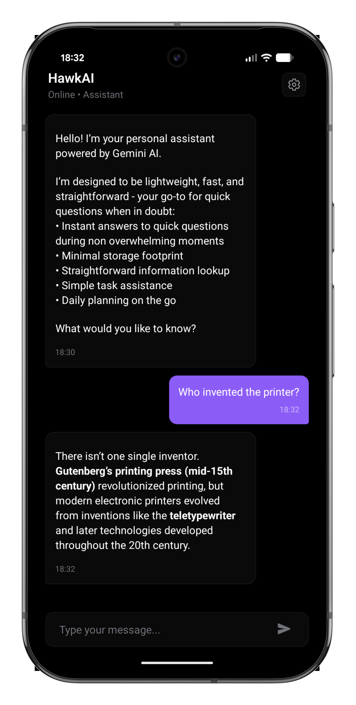
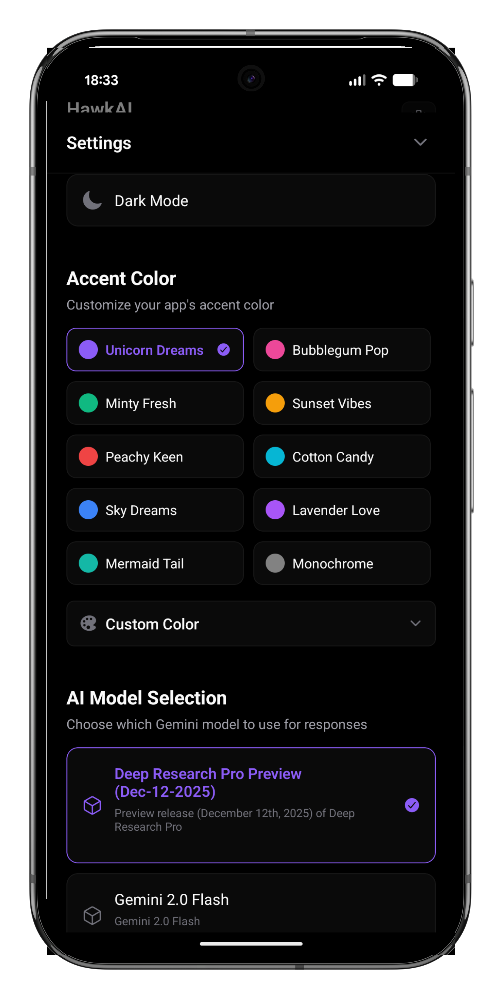

# HawkAI - Personal Assistant

A lightweight personal assistant mobile app built with React Native and Expo, powered by Google's Gemini AI. Features a clean, modern chat interface with customizable themes and multi-language support.

## 📸 Screenshots

<div style="display: flex; gap: 20px; justify-content: center; align-items: center;">
  
  
</div>

## ✨ Features

- 🤖 **Gemini AI Integration** - Powered by Google's cost-effective Gemini Flash model
- 📱 **Cross-Platform** - Runs on Android, iOS, and web
- 💬 **Modern Chat UI** - Clean, minimalist chat interface
- 🎨 **Customizable Themes** - Light/Dark mode with accent color options
- 🌍 **Multi-Language** - English and French support
- 💰 **Cost Optimized** - Designed to minimize API consumption
- ⚡ **Fast & Responsive** - Built with Expo for optimal performance

## 🚀 Quick Start

### Prerequisites
- Node.js 18 or later
- Expo Go app on your mobile device
- Gemini API key ([Get one here](https://makersuite.google.com/app/apikey))

### Installation

1. **Clone the repository**
   ```bash
   git clone https://github.com/yourusername/hawkai.git
   cd hawkai
   npm install
   ```

2. **Start the app**
   ```bash
   npm start
   ```

3. **Run on your device**
   - Scan the QR code with Expo Go (Android) or Camera app (iOS)
   - Or use `npm run android` / `npm run ios` for emulators

4. **Configure your API key**
   - Tap the settings icon in the app
   - Add your Gemini API key

## 📁 Project Structure

```
├── App.js                    # Main application component
├── config.js                 # Configuration and settings
├── languages.js              # Internationalization support
├── components/
│   ├── CustomChat.js         # Chat interface component
│   ├── SettingsModal.js      # Settings panel
│   └── ApiKeyModal.js        # API key configuration
├── services/
│   └── aiService.js          # AI provider abstraction
└── docs/
    └── SETUP.md              # Detailed setup guide
```

## 🎨 Customization

### Theme Settings
The app supports light/dark themes with multiple accent colors. Configure defaults in `config.js`:

```javascript
UI: {
  DEFAULT_THEME: 'SYSTEM',
  DEFAULT_ACCENT: 'UNICORN_DREAMS',
  DEFAULT_LANGUAGE: 'en',
}
```

### AI Settings
```javascript
GEMINI: {
  MODEL_NAME: 'gemini-1.5-flash',
  MAX_TOKENS: 150,
  TEMPERATURE: 0.7,
}
```

## 📱 Platform Support

- ✅ **Android** - Full support with Expo Go or standalone APK
- ✅ **iOS** - Full support (requires macOS for development builds)
- ✅ **Web** - Browser-based version for testing

## 🛠 Development

```bash
npm start          # Start development server
npm run android    # Run on Android
npm run ios        # Run on iOS
npm run web        # Run in browser
```

### Building for Production
```bash
# Install EAS CLI
npm install -g @expo/eas-cli

# Build Android APK
eas build --platform android --profile preview

# Build for iOS
eas build --platform ios
```

## 📄 License

This project is licensed under the MIT License - see the [LICENSE](LICENSE) file for details.

## 🆘 Resources

- [Expo Documentation](https://docs.expo.dev/)
- [Gemini AI Documentation](https://ai.google.dev/)
- [React Native Documentation](https://reactnative.dev/)

---

Made with ❤️ by BLWK Studio
